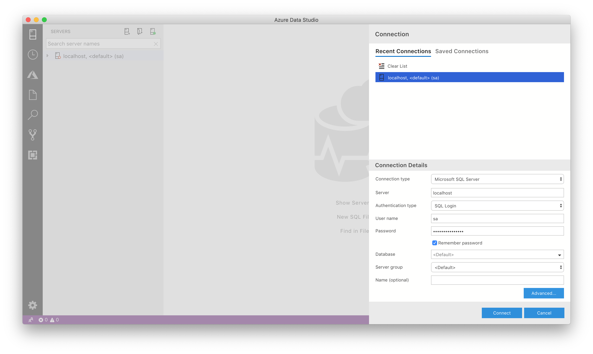
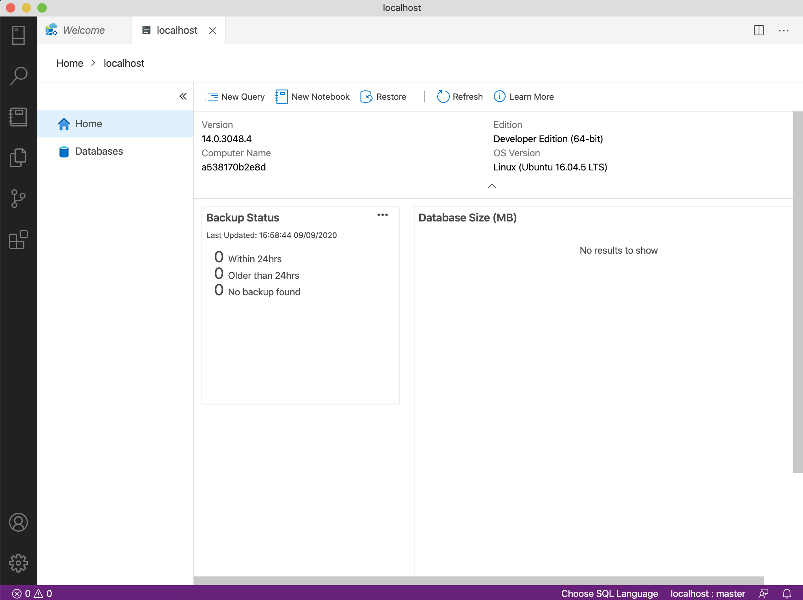

## SQL Server + SQL Operations Studio

Essa solução foi criada a partir da necessidade de ter uma instância de um servidor de Microsoft SQL Server no Mac OS, para desenvolvimento de aplicações, sem precisar de uma VM ou acesso remoto a máquinas Windows.

#### Pre-requisitos
* docker
* docker compose

### Subir o container:

Clone o repositório

```
$ git clone https://github.com/luumarodrigues/sql-server.docker.git
```
Execute o docker-compose

```
$ docker-compose up -d
```

### Instalar cliente MSSQL

- Fazer download e instalação do Azure Data Studio [aqui](https://docs.microsoft.com/en-us/sql/azure-data-studio/download?view=sql-server-2017)

- Após a instalação, executar o Azure Data Studio
<p align="center">
  
</p>

- Preencher os dados de acesso

```
Server:localhost
Username: sa
Password: YourPassword (ou a que você tiver configurado em docker-compose.yaml)
```
- Clicar em Connect e deverá ter esse resultado:
<p align="center">
  
</p>


